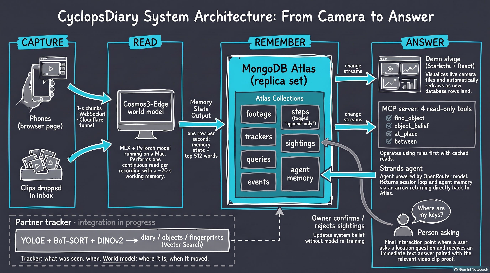

Claude Session Log - https://youtu.be/eJxuouv2Qa0

# CyclopsDiary

**Long-horizon memory for a world model.** A world model watching a camera remembers about twenty seconds.
CyclopsDiary keeps everything after that in MongoDB, in the model's own terms. Every second of every camera
becomes a row, and the rows can be searched across cameras, people and days with the model's own output head.
It uses no second model, no training and no cosine similarity.



## The problem

Questions about the physical world span hours, days and many people's cameras. "Where did I leave this?",
"When did that get moved?" and "Who last had it?" all ask about something that happened far outside any one
model's view.

A video world model such as NVIDIA's Cosmos3-Edge reads video with a working memory of 8,192 tokens. At phone
resolution that is about 23 seconds of video. Everything older is gone from the model, and a question usually
comes an hour, a day or a week later. The answer may also sit in someone else's footage.

The usual workarounds each lose something:
- **Captioning clips with a second model** throws away the world model's own state and adds a second opinion
  of what happened.
- **Frame embeddings with cosine similarity** lose time, and they lose the model's own vocabulary for what it
  saw.
- **Cutting video into short clips** resets the model's memory at every cut.

Doing the task well needs three things the model alone does not have:
- **Identity across views:** the same object seen from other cameras.
- **Memory across time:** hours, not seconds.
- **Evidence:** the clip that shows it.

This is object permanence across cameras, people and time.

## The idea: the model's memory continues outside the model

- **One continuous read per recording.** Cosmos3-Edge reads each recording as a single input and carries its
  memory the whole way. Video is never cut into intervals read separately.
- **One row per second, in the model's own terms.** Each second read becomes a row in MongoDB Atlas. The row
  holds the model's memory state plus the 512 words its output head ranks highest, with their
  log-probabilities: about 7.4 KB. Rows are append-only, and raw footage is never changed; rows point at it by
  path and sha256.
- **Search with the model's own formula.** An example span of any recording is scored against every stored
  second with the output-head formula: `score = Σ_w q(w) · (log p_step(w) − mean over the searched set of
  log p(w))`. Here q is the example's own distribution. Alignment over time uses a subsequence DTW whose
  cost is 1 − score. What "stands apart" is cut from each search's own scores, never from a constant, so the
  cut holds as the memory grows. An example can also be searched in reverse: the example of a thing put
  down, reversed, finds it being taken away.
- **Records and beliefs are kept apart.** An object's sightings carry when they happened in the world, when
  the system found them, and when a person confirmed or rejected them. Where the object is now is read off
  its sightings each time, never stored. A new record corrects the belief without rewriting history, and
  confirming or rejecting a sighting teaches the tracker without training anything.
- **Shared footage, private objects.** Footage and steps belong to the workspace. Each person's objects,
  trackers and sightings are their own, and every read of them filters on that person.

## Architecture

The diagram above reads left to right:

1. **Capture.** Phones stream from a browser page: one-second chunks over a WebSocket, through a Cloudflare
   quick tunnel, with no app to install. Recorded clips are dropped into an inbox folder per camera.
2. **Read.** `serve` runs Cosmos3-Edge on a Mac, with the vision tower in PyTorch and the language model in
   MLX. It keeps one continuous read per recording, and several cameras share one loaded model.
3. **Remember.** MongoDB Atlas, a replica set, holds these collections:
   - `footage` and `steps`: the shared record.
   - `trackers` and `sightings`: each person's objects and beliefs.
   - `queries` and `events`: a question is a row, and so is each answer.
   - `agent_*`: the agent's sessions, messages and notes.

   Schema validation refuses malformed rows before they reach the worker.
4. **Answer.** Change streams do three jobs:
   - They wake the worker when a query is written.
   - They drop the router's cached answers when a sighting changes.
   - They feed the stage.

   Questions are answered by four read-only tools over MCP (`find_object`, `object_belief`, `at_place`,
   `between`). Rules answer the common questions first, and a model picks the tool for the rest. A Strands
   agent keeps its session, memory and context in MongoDB. The stage (Starlette + React) draws the cameras,
   the memory, and an object's trail through time.

A detector-based tracker from a teammate (YOLOE + BoT-SORT + DINOv2) is being integrated separately and is not
part of this repository.

## Keeping the memory coherent over a long horizon

| Layer | Where | Horizon | Kept coherent by |
|---|---|---|---|
| Working memory | the model (8,192 tokens) | about 23 s | one continuous read per recording; the memory is never reset mid-recording |
| Every second | `steps` | forever, append-only | one pinned model and setting per workspace; a workspace read under two settings is refused, so every row compares with every other |
| Beliefs | `trackers`, `sightings` | the object's whole trail | observed, recorded, confirmed and rejected times; the last known place is derived, never stored |
| Conversations | `agent_sessions`, `agent_messages`, `agent_notes` | across restarts | Strands' session and memory interfaces over MongoDB; recall by a text index in one aggregation |
| Context | the agent's system prompt | each session | the workspace read fresh by aggregation: cameras, latest moments, open questions, notes |

The agent's context does not grow with the footage. It answers from beliefs through four tools, so a month of
footage costs it the same context as a minute.

**Scale (derived from the pinned setting, not a load test).**

| Quantity | Value |
|---|---|
| Tokens per camera-second | 360 video tokens (two frames of 18 × 10 merged patches) |
| Size of one camera-hour | about 1.3 M tokens and 26.6 MB of rows |
| One billion tokens | about 770 camera-hours, about 20 GB of rows |
| One Mac | reads at 3.3× real time, so about three cameras |

## What is measured

All figures come from runs on the team's Atlas cluster and an Apple Silicon Mac.

- **Read.** Cosmos3-Edge reads phone video at 3.26× real time, and resampling at decode kept the rows
  byte-identical. A step is 7.4 KB on Atlas.
- **Live.** A phone stream through the tunnel returned its first step 2.2 s after its first chunk. Two phones
  streamed at once and each recording was read to its end.
- **Change streams.** A query row is claimed by the worker 0.03 s after it is written.
- **Answers.** Rule-routed questions take 0.002 s with cached reads. When the model picks the tool, the p50 is
  0.52–0.60 s and the p95 is 0.79–0.85 s over 60 turns.
- **Identifying objects by the model's own words (small evals).**
  - On 17 labelled seconds from two phones: P@1 .67, P@support .66.
  - On three live phone recordings, the name "keys" alone also matched a laptop keyboard (precision .69).
    Searched by a short description, P@1 1 and P@support .99. That description was chosen from the same
    recordings, so the figure is fitted to them.
  - Presence is weak: 7 of 8 objects that were not in the footage still got a sighting.
- **The rejected alternative.** A detector-based tracker (YOLOE-11s + BoT-SORT) on the same 17-second eval scored
  P@1 .17 and P@support .12 by name.

These evals are small. They show the method works end to end; they are not accuracy claims at scale.

## Run it

Requirements: an Apple Silicon Mac; Python 3.11 with `requirements-cyclopsdiary.txt`; the Cosmos3-Edge weights
(`nvidia/Cosmos3-Edge`, about 8.5 GB) in the local Hugging Face cache; and the model's transformers-5 side stack
in `data/stacks/d40` (see `data/stacks/README.md`).

```bash
cp .env.example .env              # MONGODB_URI (Atlas), MONGODB_DB; OPENROUTER_API_KEY for the agent
bin/cyclopsdiary check            # connects, creates the collections, indexes and validators
```

Without Atlas, `scripts/mongo_local.sh` starts a local `mongod` on :27100 (`MONGODB_URI=mongodb://localhost:27100`).

```bash
# people and cameras
bin/cyclopsdiary person add alex --workspace home
bin/cyclopsdiary source add alex-phone --person alex --kind phone

# cameras in: clips in inbox/<camera>/, and phones live from a browser link
bin/cyclopsdiary serve --inbox inbox --live --tunnel

# a person's private object, found by the model's own words, tracked across every camera
bin/cyclopsdiary object add keys --person alex
bin/cyclopsdiary where keys --person alex
bin/cyclopsdiary confirm <sighting> --person alex          # or: reject

# search by example: moments like a span, or the span undone
bin/cyclopsdiary ask --footage <id> --start 12 --end 15 --reverse

# ask in words (rules first; the model picks the tool for the rest)
bin/cyclopsdiary say "where are my keys?" --person alex

# the stage: the cameras, the memory to scale, an object's trail through time
cd ui && npm install && npm run build && cd ..
bin/cyclopsdiary stage                                     # http://127.0.0.1:8790, this machine only
```

The agent lives in `agent/`, in its own virtual environment; see `agent/README.md`. Its model is set by
`AGENT_MODEL`, served through OpenRouter. `agent/check.py` checks the wiring on the database without calling
the model.

Tests:

```bash
scripts/mongo_local.sh
python3 -m pytest tests/test_cyclopsdiary.py tests/test_headsearch.py -p no:django
HF_HUB_OFFLINE=1 PYTHONPATH=data/stacks/d40:python python3 -m pytest tests/test_cosmos3_mlx.py -p no:django
```

## Layout

| Path | What |
|---|---|
| `python/cyclopsdiary/` | the system: `atlas` (collections, schema, validators), `ingest` and `live` (footage to steps), `memory` and `query` (search by example), `tracker` and `objects` (private objects, sightings, beliefs), `stream` (`serve`), `router`, `tools` and `mcp_server` (the four tools), `agentmemory`, `stage` (the stage's API), `cli` |
| `python/elidedb/` | the search engine it is built on: the continuous read (`cosmos3.py`, `cosmos3_mlx.py`), the output-head search (`headsearch.py`, `eventsearch.py`), the relative cut (`corpus.py`) |
| `agent/` | the Strands agent: MongoDB session, memory and context; tools over MCP |
| `ui/` | the stage's page (Vite, React, TypeScript) |
| `bin/cyclopsdiary` | the command line |
| `tests/` | tests for the system, the formula and the MLX read |
| `scripts/`, `eval/` | the local test database and the object evaluations |

## Not built yet

- **Scale.** Today each search and tracking pass loads the workspace's rows. At a billion tokens, tracking has
  to become incremental and search has to be windowed by time and camera. No load test has run.
- **Footage bytes.** They stay on the ingesting machine. The plan is S3 or GridFS, with rows still pointing at
  each file by sha256.
- **Old steps.** The plan is to move them to Atlas Online Archive (M10 or larger).
- **Better presence decisions.** Today an absent object can still get a sighting. The plan is a gate that makes
  a step beat decoy names before it counts.

## License

PolyForm Noncommercial 1.0.0; see `LICENSE`.
